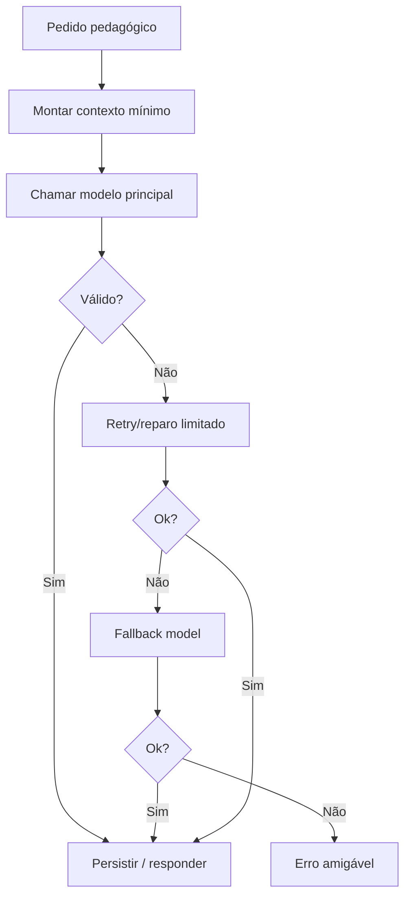

# Arquitetura de IA — BeFluent

Relacionados: [prompt-strategy.md](prompt-strategy.md), [stack.md](stack.md), [security.md](security.md), [privacy.md](privacy.md).

## Integração com OpenRouter

- Backend FastAPI chama OpenRouter com chave em variável de ambiente.
- Frontend nunca recebe a chave.
- Adaptador de provedor isola SDK/HTTP do domínio pedagógico.
- Um **modelo principal** e um **modelo de fallback**.

### Estado dos modelos

- Cadeia implementada: `OPENROUTER_MODEL` → `OPENROUTER_FALLBACK_MODEL` (`openrouter_chat_with_fallback`).
- Em production, esgotar a cadeia → `503 ai_unavailable` (sem mock silencioso).
- Fora de production, mock ainda cobre indisponibilidade para desenvolvimento.

### Ainda pendente

- Limites de tokens por tarefa.
- Temperatura por tarefa.
- Confirmar em deploy os slugs OpenRouter definitivos (hoje tipicamente nos `.env` locais).

## Abstração por provedor

Interface conceitual:

- `complete(task, messages, schema, limits) -> StructuredResult`
- `health() -> ok|degraded`
- metadados: provider, model, latency, tokens_in/out (sem conteúdo sensível em logs).

Permite trocar modelo/provedor sem reescrever regras pedagógicas.

## Timeout e retry

- Timeout por tipo de tarefa (valores exatos = decisão pendente).
- Retry controlado apenas para erros transitórios (rede/5xx).
- Não retentar indefinidamente respostas inválidas sem ajuste.
- Após esgotar retries, usar fallback de modelo; se falhar, erro amigável à API.

## Limite de tokens

- Limitar contexto e saída por tarefa.
- Preferir resumos de sessão a históricos brutos longos.
- Evitar prompts gigantes.

## Respostas estruturadas e validação

- Pedir JSON/schema quando a saída alimentar o sistema (exercício, correção, relatório).
- Validar com Pydantic no backend.
- Se inválido: uma tentativa de reparo controlada; senão, erro `invalid_ai_response`.

## Logs sem conteúdo sensível

Registrar:

- task_type, model, latency, status, token estimates, request_id.

Não registrar por padrão:

- prompts completos com dados pessoais;
- conversas integrais;
- áudio;
- chaves.

Política detalhada em [privacy.md](privacy.md) e [observability.md](observability.md).

## Indisponibilidade

- Circuit breaker simples / flag de degradação (conceitual).
- Mensagem clara ao usuário.
- Fallback textual em fluxos de voz quando possível.
- Progresso parcial deve ser preservado.

## Estimativa e controle de uso

- Contar tokens/estimativas por sessão e por dia (implementação futura).
- Alertar internamente se uso crescer de forma anômala.
- Não inventar métricas financeiras nesta etapa.

## Separação entre tarefas pedagógicas

Cada tarefa tem contrato próprio ([prompt-strategy.md](prompt-strategy.md)):

- diagnóstico;
- conversação;
- correção;
- geração de aula/exercício;
- relatório;
- adaptação por idioma (incl. espanhol da Espanha, japonês, mandarim, etc.).

Não misturar em um único prompt genérico “faz tudo”.

## Contexto de sessão e memória pedagógica

Incluir no contexto apenas:

- idioma e variante;
- nível estimado;
- objetivo da atividade;
- erros recorrentes resumidos;
- últimas interações relevantes (resumidas).

Memória de longo prazo fica no PostgreSQL (perfil, vocabulário, erros), não em prompt eterno.

## Prevenção de prompts gigantes

- Truncar histórico.
- Resumir conversas longas periodicamente.
- Separar “contexto necessário” de “arquivo morto”.

## Resumo de conversas longas

- Ao atingir limiar (decisão pendente de limiar), gerar resumo estruturado.
- Persistir resumo; manter só janela recente de mensagens detalhadas.

## Segurança contra prompt injection

- Tratar texto do usuário como dados, não como instruções de sistema.
- Instruções de sistema imutáveis por tarefa.
- Não executar ferramentas/ações baseadas em pedidos do usuário fora do escopo pedagógico.
- Validar saída antes de persistir ou exibir como fato do sistema.
- Nunca ecoar segredos ou variáveis de ambiente.

## Fluxo resumido

