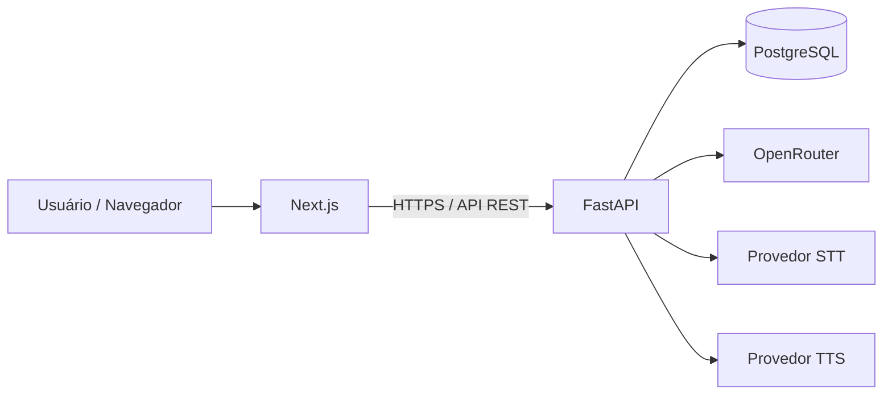
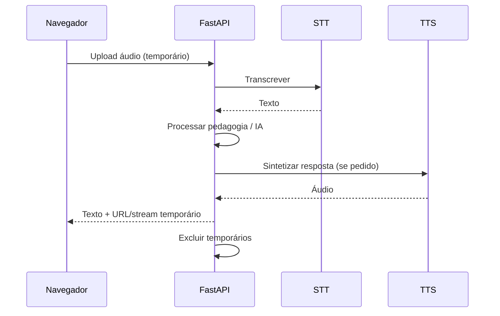

# Arquitetura — Fluentia

Documentos relacionados: [stack.md](stack.md), [database.md](database.md), [api-specification.md](api-specification.md), [deployment-coolify.md](deployment-coolify.md).

## Arquitetura geral

O Fluentia é um webapp com:

- **Frontend:** Next.js (TypeScript, App Router, Tailwind CSS).
- **Backend:** FastAPI (Python, SQLAlchemy, Alembic, Pydantic).
- **Banco:** PostgreSQL.
- **IA:** OpenRouter (modelo principal + fallback — modelos específicos = decisão pendente).
- **Áudio:** STT e TTS modulares (provedores = decisão pendente).
- **Infra:** Docker, Docker Compose, Coolify, VPS própria, HTTPS.

Redis **não** é dependência obrigatória na primeira versão. Pode ser considerado no futuro apenas se filas ou cache se tornarem necessários.



## Frontend (Next.js)

Responsabilidades:

- UI em português;
- rotas e navegação;
- formulários e estados de tela;
- gravação/reprodução de áudio no navegador;
- chamada à API autenticada por cookie;
- tratamento de estados de loading/erro/vazio.

Não deve:

- armazenar chaves de IA/áudio;
- acessar o banco diretamente;
- conter lógica pedagógica crítica (apenas apresentação e orquestração de UX).

## Backend (FastAPI)

Responsabilidades:

- autenticação e autorização;
- regras de negócio e motor pedagógico;
- persistência via SQLAlchemy;
- migrações com Alembic;
- integração com OpenRouter e provedores de voz;
- validação com Pydantic;
- exclusão de arquivos temporários de áudio;
- logs estruturados e healthcheck.

## PostgreSQL

Fonte da verdade para usuários, progresso, planos, sessões, vocabulário, tentativas e auditoria.

Detalhamento em [database.md](database.md).

## Serviços externos

| Serviço | Uso | Status |
|---|---|---|
| OpenRouter | LLM principal e fallback | Confirmado (modelos pendentes) |
| STT | Transcrição | Decisão pendente |
| TTS | Síntese de voz | Decisão pendente |
| Avaliação fonética | Pronúncia precisa | Decisão pendente / opcional |
| Armazenamento externo de arquivos | Áudio/arquivos | Decisão pendente |

## Separação de responsabilidades

| Camada | Faz | Não faz |
|---|---|---|
| UI | Interação e apresentação | Segredos e SQL |
| API | Orquestra casos de uso | UI |
| Domínio pedagógico | Regras de aprendizado | Detalhes de HTTP |
| Integrações | Adaptadores de IA/áudio | Regras de negócio misturadas |
| Persistência | Repositórios/ORM | Decisões pedagógicas |

## Comunicação frontend–backend

- API REST sob `/api/v1`.
- `GET /health` fora do versionamento de negócio.
- JSON como formato padrão.
- Autenticação por sessão em cookie HTTP-only.
- CORS restrito à origem do frontend.

## Autenticação

- Um usuário autorizado inicialmente.
- Sem cadastro público.
- Senha com hash seguro no backend.
- Cookie HTTP-only, Secure em produção, SameSite adequado.
- Proteção CSRF conforme estratégia em [security.md](security.md).

## Armazenamento

- Dados estruturados no PostgreSQL.
- Áudio: preferencialmente temporário no backend, excluído após uso.
- Armazenamento externo permanente = decisão pendente (evitar se não necessário).

## Fluxo de áudio (visão)



## Tarefas demoradas

Na primeira versão, preferir:

- requisições síncronas com timeout controlado;
- feedback de loading no frontend;
- retries limitados.

Se no futuro houver filas longas (lote de TTS, jobs pesados), avaliar Redis ou fila equivalente — **somente com necessidade real documentada**.

## Estrutura modular (conceitual)

```
frontend/          # Next.js
backend/           # FastAPI
  api/             # rotas
  domain/          # regras
  integrations/    # OpenRouter, STT, TTS
  db/              # modelos, migrações
docs/              # documentação
```

Estrutura de pastas exata será definida na Fase 1 do [roadmap.md](roadmap.md).

## Execução local

- Docker Compose para PostgreSQL (e opcionalmente app).
- Frontend e backend em desenvolvimento local.
- Variáveis de ambiente locais (nunca commitadas).
- Testes locais antes de qualquer deploy.

## Deploy no Coolify

- Imagens Docker do frontend e backend.
- PostgreSQL gerenciado conforme estratégia de deploy.
- HTTPS, healthchecks, variáveis de ambiente, backups.
- Detalhes em [deployment-coolify.md](deployment-coolify.md).

## Redis

- **Não obrigatório** inicialmente.
- Possibilidade futura apenas para cache ou filas.
- Qualquer introdução deve ser registrada em [decisions.md](decisions.md).
