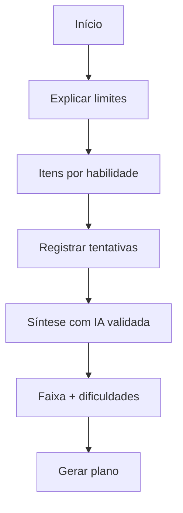

# Sistema de Avaliação — BeFluent

Relacionados: [learning-engine.md](learning-engine.md), [prompt-strategy.md](prompt-strategy.md), [database.md](database.md).

## Objetivo

Estimar nível, acompanhar progresso e orientar o plano **sem falsa precisão**.

## Tipos de avaliação

| Tipo | Quando | Finalidade |
|---|---|---|
| Diagnóstico inicial | Ao ativar idioma | Perfil inicial |
| Avaliação de progresso | Periodicamente | Ajustar plano |
| Teste rápido | Após blocos | Checagem leve |
| Por habilidade | Sob demanda | Leitura, escrita, escuta, etc. |

## Habilidades avaliadas

- Leitura
- Escrita
- Compreensão auditiva
- Conversação
- Vocabulário
- Gramática
- Pronúncia (com limitações se não houver provedor fonético)

## Referenciais por idioma

Usar como **referência orientativa**, não equivalência automática rígida:

| Idioma | Referência |
|---|---|
| Inglês | CEFR |
| Francês | CEFR |
| Espanhol da Espanha | CEFR |
| Japonês | JLPT |
| Mandarim | HSK |

O sistema pode dizer: “estimativa aproximada alinhada a X”, com ressalvas.

## Critérios

- Cobertura mínima de habilidades relevantes ao idioma.
- Itens adequados ao que se pretende medir.
- Tempo razoável (diagnóstico não deve ser maratona).
- Evidência suficiente antes de mudar faixa de nível.

## Modelo conceitual de pesos

Os números abaixo são **apenas exemplos ilustrativos** de um modelo conceitual. **Não são valores definitivos** e **não devem ser interpretados como regra fechada** de implementação.

### Exemplo ilustrativo (não definitivo)

Em um diagnóstico geral hipotético, uma distribuição possível poderia ser:

- conversação/uso: 25%;
- escuta: 20%;
- vocabulário: 15%;
- gramática: 15%;
- leitura: 15%;
- escrita: 10%.

Esse exemplo serve só para mostrar que habilidades podem ter importâncias diferentes. Qualquer configuração real é **futura** e dependerá de testes.

### Configuração futura (a definir)

- Os pesos efetivos serão definidos após testes.
- Cada idioma poderá usar pesos diferentes (ex.: mandarim pode valorizar mais tons/escuta; japonês, leitura de scripts; francês, pronúncia).
- Pronúncia só deve pesar forte quando houver método confiável; caso contrário, preferir feedback qualitativo com peso reduzido ou nulo.

## Status dos pesos

- Os pesos finais serão definidos após testes.
- Cada idioma poderá usar pesos diferentes.
- Conversação, escrita, leitura, escuta, gramática e vocabulário **não precisam** ter a mesma relevância em todos os idiomas.
- Não deve haver falsa precisão: percentuais ilustrativos não autorizam notas “exatas” de nível na interface.

## Limitações

- IA pode errar na correção.
- STT ≠ pronúncia fonética.
- Amostra curta ≠ nível real.
- Efeito de nervosismo/interface.

Toda saída de nível deve incluir **incerteza/limitação**.

## Feedback

- Claro, respeitoso, em português quando necessário.
- Destacar 3 prioridades, não 30 problemas.
- Ligar feedback a próximas atividades.

## Reavaliação

- Após N sessões ou ao concluir marco do plano (N = decisão pendente).
- Também se o desempenho divergir muito do nível estimado.
- Evitar reavaliar o tempo todo.

## Prevenção de falsa precisão

Proibido apresentar:

- “Você é C1 com 93,7% de certeza” sem base sólida;
- conversões automáticas JLPT↔CEFR↔HSK como verdade;
- pesos ilustrativos como se fossem configuração oficial.

Preferir:

- faixas;
- habilidades separadas;
- linguagem de estimativa;
- recomendações práticas.

## Fluxo do diagnóstico

## Critérios de qualidade da avaliação

- Resultados reproduzíveis o bastante para orientar estudo.
- Usuário entende o que fazer depois.
- Dados persistidos permitem comparação futura.
- Nenhuma afirmação absoluta indevida na UI.
