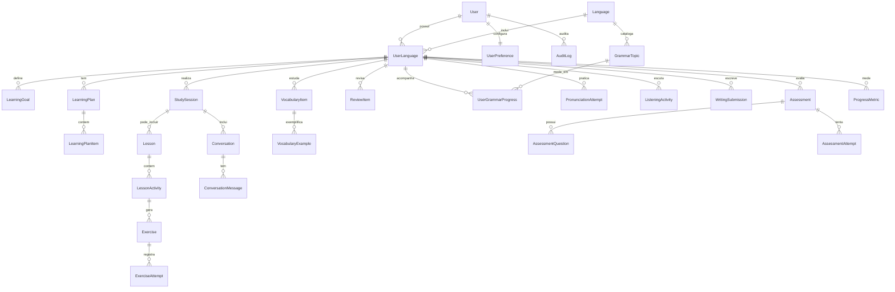

# Banco de Dados — Fluentia

Documento conceitual. **Não criar SQL nem migrations nesta etapa.**

Relacionados: [architecture.md](architecture.md), [privacy.md](privacy.md), [security.md](security.md).

## Princípios

- PostgreSQL como fonte da verdade.
- Um usuário autorizado inicialmente (modelo preparado para `User`).
- Minimizar dados sensíveis e áudio permanente.
- Soft delete apenas quando houver necessidade de auditoria/histórico; caso contrário, exclusão física controlada.
- Retenção: ver [privacy.md](privacy.md) — política final = decisão pendente.

## Diagrama ER simplificado

Cardinalidades consideram **um usuário autorizado agora**, sem impedir evolução futura (vários `UserLanguage`, vários planos, várias sessões).

Relações obrigatórias reforçadas neste diagrama:

- `Language` 1—N `GrammarTopic`
- `UserLanguage` 1—N `UserGrammarProgress`
- `User` 1—1 `UserPreference`
- `Language` 1—N `UserLanguage`
- `StudySession` 1—N `Conversation`
- `LearningPlan` 1—N `LearningPlanItem`
- `Assessment` 1—N `AssessmentQuestion`
- `Assessment` 1—N `AssessmentAttempt`

### Associação polimórfica `ReviewItem` (não é FK rígida no diagrama)

`ReviewItem` liga-se a `UserLanguage` (FK real) e referencia outros objetos por `item_type` + `reference_id` (ex.: `VocabularyItem`, erro gramatical, etc.).

Por isso **não** há aresta Mermaid `VocabularyItem ||--o{ ReviewItem` como chave estrangeira direta: o vínculo é lógico/polimórfico. Quando `item_type` indicar vocabulário, `reference_id` aponta para `VocabularyItem`.
## Entidades

### User

- **Finalidade:** conta do usuário autorizado.
- **Campos principais:** id, email, password_hash, name, is_active, created_at, updated_at, last_login_at.
- **Relacionamentos:** UserLanguage, UserPreference, AuditLog.
- **Índices:** único em email.
- **Exclusão:** restrita; preferir desativar (`is_active=false`) + processo de exclusão de dados.
- **Sensíveis:** email, hash de senha.
- **Retenção:** enquanto a conta existir; exclusão sob solicitação/política.

### Language

- **Finalidade:** catálogo de idiomas.
- **Campos:** id, code (`en`, `es-ES`, `fr`, `ja`, `zh-CN` — codes exatos = decisão de implementação), name_pt, variant_note, is_active.
- **Relacionamentos:** UserLanguage, GrammarTopic (catálogo por idioma).
- **Índices:** único em code.
- **Exclusão:** soft (desativar); não apagar se houver histórico.
- **Sensíveis:** não.
- **Retenção:** permanente de catálogo.

### UserLanguage

- **Finalidade:** vínculo usuário–idioma e estado de estudo.
- **Campos:** id, user_id, language_id, level_estimate, onboarding_completed, diagnostic_completed, is_active, started_at, updated_at.
- **Relacionamentos:** LearningGoal, LearningPlan, StudySession, VocabularyItem, ReviewItem, UserGrammarProgress, Assessment, ProgressMetric e demais atividades de estudo.
- **Índices:** único (user_id, language_id); índice em is_active.
- **Exclusão:** cascata controlada ou arquivamento.
- **Sensíveis:** progresso pessoal.
- **Retenção:** enquanto idioma estiver em uso / política.

### LearningGoal

- **Finalidade:** objetivos do aluno no idioma.
- **Campos:** id, user_language_id, goal_type, description, priority, target_date nullable, status, created_at.
- **Relacionamentos:** UserLanguage.
- **Índices:** user_language_id + status.
- **Exclusão:** com o vínculo ou arquivar.
- **Sensíveis:** não críticos.
- **Retenção:** histórico útil ao plano.

### LearningPlan

- **Finalidade:** plano de estudo vigente.
- **Campos:** id, user_language_id, version, status, generated_from, created_at, updated_at.
- **Relacionamentos:** LearningPlanItem (1 plano contém N itens ordenados).
- **Índices:** user_language_id + status.
- **Exclusão:** manter histórico de versões.
- **Sensíveis:** progresso.
- **Retenção:** histórico de planos.

### LearningPlanItem

- **Finalidade:** item ordenado do plano.
- **Campos:** id, plan_id, position, activity_type, title, status, due_at nullable, completed_at nullable, metadata_json.
- **Relacionamentos:** LearningPlan.
- **Índices:** plan_id + position; status.
- **Exclusão:** com o plano.
- **Sensíveis:** não.
- **Retenção:** com o plano.

### StudySession

- **Finalidade:** sessão de estudo.
- **Campos:** id, user_language_id, started_at, ended_at, status, summary_short, created_at.
- **Relacionamentos:** Lesson, Conversation (1 sessão pode incluir N conversas), tentativas diversas, ProgressMetric.
- **Índices:** user_language_id + started_at.
- **Exclusão:** retenção de histórico; exclusão sob política.
- **Sensíveis:** conteúdo derivado.
- **Retenção:** importante para progresso.

### Lesson

- **Finalidade:** aula guiada.
- **Campos:** id, study_session_id nullable, user_language_id, title, objective, content_json, status, created_at.
- **Relacionamentos:** LessonActivity.
- **Índices:** user_language_id; status.
- **Exclusão:** manter se houver tentativas.
- **Sensíveis:** conteúdo gerado.
- **Retenção:** histórico pedagógico.

### LessonActivity

- **Finalidade:** etapa dentro da aula.
- **Campos:** id, lesson_id, position, activity_type, prompt, payload_json, status.
- **Relacionamentos:** Lesson, Exercise.
- **Índices:** lesson_id + position.
- **Exclusão:** com a aula.
- **Sensíveis:** não.
- **Retenção:** com a aula.

### Exercise

- **Finalidade:** exercício avaliável.
- **Campos:** id, lesson_activity_id nullable, user_language_id, exercise_type, prompt, answer_key_json, difficulty, created_at.
- **Relacionamentos:** ExerciseAttempt.
- **Índices:** user_language_id + exercise_type.
- **Exclusão:** manter se houver attempts.
- **Sensíveis:** não.
- **Retenção:** histórico.

### ExerciseAttempt

- **Finalidade:** tentativa do usuário.
- **Campos:** id, exercise_id, study_session_id nullable, response_json, is_correct, score nullable, feedback_json, created_at.
- **Relacionamentos:** Exercise, StudySession.
- **Índices:** exercise_id; study_session_id.
- **Exclusão:** retenção para erros recorrentes.
- **Sensíveis:** respostas do usuário.
- **Retenção:** alta relevância pedagógica.

### Conversation

- **Finalidade:** conversa (texto/voz).
- **Campos:** id, study_session_id, user_language_id, mode (text/voice/mixed), topic, status, created_at, ended_at.
- **Relacionamentos:** ConversationMessage; StudySession (N conversas podem pertencer a 1 sessão).
- **Índices:** user_language_id; study_session_id.
- **Exclusão:** política de privacidade.
- **Sensíveis:** conteúdo conversacional.
- **Retenção:** decisão pendente (mínimo necessário).

### ConversationMessage

- **Finalidade:** mensagem na conversa.
- **Campos:** id, conversation_id, role (user/assistant/system), content_text, corrections_json nullable, source (text/stt), created_at.
- **Relacionamentos:** Conversation.
- **Índices:** conversation_id + created_at.
- **Exclusão:** com a conversa / política.
- **Sensíveis:** conteúdo.
- **Retenção:** preferir resumo de longas conversas; detalhe completo conforme política.

### VocabularyItem

- **Finalidade:** item lexical do usuário.
- **Campos:** id, user_language_id, term, reading_or_pinyin nullable, translation_pt, notes, status, ease/stability fields (SRS), next_review_at, created_at, updated_at.
- **Relacionamentos:** VocabularyExample; pode ser referenciado por zero ou mais `ReviewItem` via associação polimórfica (`item_type` + `reference_id`), sem FK rígida obrigatória nesta modelagem conceitual.
- **Índices:** user_language_id + next_review_at; term.
- **Exclusão:** soft possível.
- **Sensíveis:** progresso.
- **Retenção:** enquanto idioma ativo.

### VocabularyExample

- **Finalidade:** exemplos de uso.
- **Campos:** id, vocabulary_item_id, example_text, translation_pt nullable, audio_ref nullable.
- **Relacionamentos:** VocabularyItem.
- **Índices:** vocabulary_item_id.
- **Exclusão:** com o item.
- **Sensíveis:** não.
- **Retenção:** com o item. `audio_ref` não deve apontar para armazenamento permanente sem necessidade.

### ReviewItem

- **Finalidade:** fila de revisão (SRS / erros).
- **Campos:** id, user_language_id, item_type, reference_id, priority, next_review_at, suspended, mastery_state, payload_json, updated_at.
- **Relacionamentos:** UserLanguage (FK); associação polimórfica com `VocabularyItem` e outros alvos via `item_type` + `reference_id` (não FK única no diagrama ER).
- **Índices:** user_language_id + next_review_at; suspended; índice composto recomendado em (`item_type`, `reference_id`).
- **Exclusão:** ao domínio ou suspensão longa.
- **Sensíveis:** progresso.
- **Retenção:** enquanto ativo.

### GrammarTopic

- **Finalidade:** catálogo de tópicos gramaticais por idioma.
- **Campos:** id, language_id, code, title_pt, description, difficulty_band.
- **Relacionamentos:** Language (tópico pertence a 1 idioma); UserGrammarProgress.
- **Índices:** language_id + code único.
- **Exclusão:** desativar.
- **Sensíveis:** não.
- **Retenção:** catálogo.

### UserGrammarProgress

- **Finalidade:** progresso do usuário em tópico.
- **Campos:** id, user_language_id, grammar_topic_id, mastery, last_practiced_at, error_count, updated_at.
- **Relacionamentos:** GrammarTopic; UserLanguage (progresso do vínculo usuário–idioma em cada tópico).
- **Índices:** único (user_language_id, grammar_topic_id).
- **Exclusão:** com vínculo.
- **Sensíveis:** progresso.
- **Retenção:** histórico útil.

### PronunciationAttempt

- **Finalidade:** tentativa de pronúncia.
- **Campos:** id, user_language_id, study_session_id nullable, target_text, transcript nullable, score nullable, feedback_json, created_at. Áudio bruto: não persistir por padrão.
- **Relacionamentos:** UserLanguage, StudySession.
- **Índices:** user_language_id + created_at.
- **Exclusão:** política; áudio temporário fora do banco.
- **Sensíveis:** voz/transcrição.
- **Retenção:** metadados; áudio só se necessário (evitar).

### ListeningActivity

- **Finalidade:** atividade de compreensão auditiva.
- **Campos:** id, user_language_id, study_session_id nullable, prompt, audio_source_type, questions_json, result_json, created_at.
- **Relacionamentos:** UserLanguage, StudySession.
- **Índices:** user_language_id + created_at.
- **Exclusão:** política.
- **Sensíveis:** respostas.
- **Retenção:** histórico de prática.

### WritingSubmission

- **Finalidade:** produção escrita.
- **Campos:** id, user_language_id, study_session_id nullable, prompt, content_text, feedback_json, score nullable, created_at.
- **Relacionamentos:** UserLanguage, StudySession.
- **Índices:** user_language_id + created_at.
- **Exclusão:** política de privacidade.
- **Sensíveis:** texto do usuário.
- **Retenção:** útil para erros; política pendente.

### Assessment

- **Finalidade:** diagnóstico ou avaliação de progresso.
- **Campos:** id, user_language_id, assessment_type, framework_ref nullable (CEFR/JLPT/HSK como referência, não equivalência rígida), status, created_at, completed_at.
- **Relacionamentos:** AssessmentQuestion (1—N); AssessmentAttempt (1—N).
- **Índices:** user_language_id + assessment_type.
- **Exclusão:** manter histórico.
- **Sensíveis:** resultados.
- **Retenção:** alta.

### AssessmentQuestion

- **Finalidade:** questão da avaliação.
- **Campos:** id, assessment_id, position, skill, prompt, payload_json.
- **Relacionamentos:** Assessment.
- **Índices:** assessment_id + position.
- **Exclusão:** com assessment.
- **Sensíveis:** não.
- **Retenção:** com assessment.

### AssessmentAttempt

- **Finalidade:** tentativa/resposta.
- **Campos:** id, assessment_id, question_id nullable, response_json, result_json, created_at.
- **Relacionamentos:** Assessment.
- **Índices:** assessment_id.
- **Exclusão:** com assessment.
- **Sensíveis:** respostas.
- **Retenção:** com assessment.

### ProgressMetric

- **Finalidade:** métricas agregadas.
- **Campos:** id, user_language_id, metric_key, metric_value, period, computed_at, source.
- **Relacionamentos:** UserLanguage.
- **Índices:** user_language_id + metric_key + period.
- **Exclusão:** recalculáveis; podem ser regeneradas.
- **Sensíveis:** progresso.
- **Retenção:** agregados preferíveis a dados brutos longos.

### UserPreference

- **Finalidade:** preferências operacionais persistentes (fonte principal de `/settings` na API).
- **Campos:** id, user_id, default_language_id nullable, tts_speed, ui_prefs_json, updated_at.
- **Relacionamentos:** User (1—1).
- **Índices:** único user_id.
- **Exclusão:** com usuário.
- **Sensíveis:** preferências.
- **Retenção:** com conta.
- **Nota:** dados de identidade (nome, imagem) ficam em `User`/`/profile`; não duplicar em `UserPreference`.

### AuditLog

- **Finalidade:** auditoria de eventos relevantes.
- **Campos:** id, user_id nullable, action, resource_type, resource_id, ip_hash nullable, metadata_json, created_at.
- **Relacionamentos:** User.
- **Índices:** user_id + created_at; action.
- **Exclusão:** retenção limitada.
- **Sensíveis:** metadados de acesso — evitar conteúdo de conversa/áudio.
- **Retenção:** decisão pendente (prazo).

## Notas

- Campos SRS detalhados dependem da decisão pendente P-010 (SM-2 vs FSRS). FSRS é só recomendação provisória; ver [spaced-repetition.md](spaced-repetition.md) e [decisions.md](decisions.md).
- `ReviewItem` → `VocabularyItem` é vínculo polimórfico, não FK direta no ER.
- Não modelar pagamento, assinatura ou multi-tenant público.
- Codes de idioma e política final de retenção = decisões a registrar em [decisions.md](decisions.md) quando fechadas.
