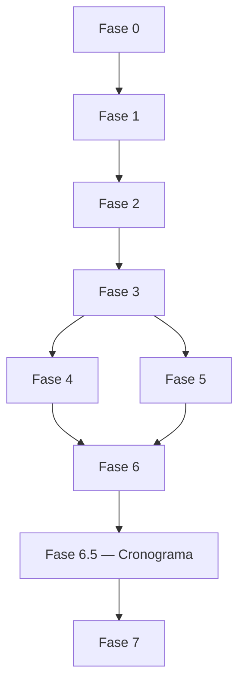

# Roadmap — BeFluent

Relacionados: [product-requirements.md](product-requirements.md), [testing-strategy.md](testing-strategy.md), [acceptance-criteria.md](acceptance-criteria.md), [decisions.md](decisions.md).

## Nota

Nem tudo é implementado ao mesmo tempo. Cada fase tem critério de conclusão. Sem testes locais, não avançar.

---

## Fase 0 — Documentação e decisões

- **Objetivo:** fundar o entendimento do produto e da arquitetura.
- **Entregáveis:** docs em `docs/` (visão, stack, requisitos, arquitetura, etc.).
- **Testes:** revisão de consistência entre documentos.
- **Conclusão:** documentos principais existem e não se contradizem; decisões pendentes listadas.
- **Dependências:** nenhuma técnica.
- **Riscos:** escopo documental excessivo; mitigar com foco e fases.

## Fase 1 — Fundação técnica

- **Objetivo:** esqueleto executável local.
- **Entregáveis:** frontend Next.js inicial; backend FastAPI; PostgreSQL; autenticação; cookie HTTP-only; `GET /health`.
- **Testes:** unit/API auth; migração; health; app sobe local.
- **Conclusão:** usuário autorizado faz login/logout; rotas protegidas; health ok.
- **Dependências:** Fase 0.
- **Riscos:** over-setup; manter mínimo.

## Fase 2 — Idiomas, onboarding, diagnóstico, plano

- **Objetivo:** ativar estudo por idioma.
- **Entregáveis:** catálogo dos 5 idiomas (incl. espanhol da Espanha); onboarding; diagnóstico; geração de plano.
- **Testes:** integração dos fluxos; mocks de IA se necessário.
- **Conclusão:** usuário escolhe idioma, completa diagnóstico e vê plano.
- **Dependências:** Fase 1.
- **Riscos:** diagnóstico superambicioso; manter curto.

## Fase 3 — Aula guiada, conversação textual, IA inicial

- **Objetivo:** primeira prática real com tutor.
- **Entregáveis:** aulas guiadas; conversação texto; OpenRouter com validação/fallback.
- **Testes:** API com mock/real controlado; falhas de IA.
- **Conclusão:** sessão com aula/conversa e feedback persistido.
- **Dependências:** Fase 2; chave OpenRouter em env (não documentar valor).
- **Riscos:** custo/tokens; prompts gigantes — seguir [ai-architecture.md](ai-architecture.md).

## Fase 4 — Áudio, STT, TTS, voz

- **Objetivo:** conversação por voz com arquitetura modular.
- **Entregáveis:** gravação; STT; TTS; fallback textual; limpeza de temporários.
- **Testes:** mocks de provedores; permissão negada; HTTPS em staging quando houver.
- **Conclusão:** fluxo de voz funciona ou degrada para texto sem travar.
- **Dependências:** Fase 3; **provedores = decisão pendente**.
- **Riscos:** provedor inadequado; privacidade de áudio.

## Fase 5 — Vocabulário, SRS, gramática, escuta

- **Objetivo:** reforço e variedade de práticas.
- **Entregáveis:** vocabulário; revisão espaçada; gramática; listening.
- **Testes:** integração de fila due; geração/submit.
- **Conclusão:** usuário revisa itens devidos e pratica escuta/gramática.
- **Dependências:** Fases 2–3; decisão pendente P-010 sobre SRS deve estar autorizada antes de implementar algoritmo ([decisions.md](decisions.md), [spaced-repetition.md](spaced-repetition.md)).
- **Riscos:** SRS complexo demais cedo.

## Fase 6 — Escrita, leitura, pronúncia, relatórios

- **Objetivo:** fechar habilidades e feedback de sessão.
- **Entregáveis:** writing; reading; pronunciation (com limitações se sem provedor fonético); relatório de sessão; progresso.
- **Testes:** fluxos de submit + relatório.
- **Conclusão:** relatório gerado ao encerrar sessão; progresso consultável.
- **Dependências:** Fases 3–5.
- **Riscos:** falsa precisão de pronúncia/nível.

## Fase 6.5 — Cronograma estruturado (currículo)

- **Objetivo:** dar eixo temporal ao estudo — do nível diagnosticado até a meta, com data por dia.
- **Entregáveis:** tabelas `curricula`/`curriculum_weeks`/`curriculum_days`/`curriculum_blocks` (migration `0006_curriculum`); gerador a partir do nivelamento; rotas `/api/v1/curriculum/...`; checkpoints quinzenais com promoção; recuperação de atraso (comprimir/estender); telas `/cronograma` e `/cronograma/dia/[id]`; banco de temas e cobertura mock nos 5 idiomas.
- **Testes:** geração em 90/180 dias e níveis de entrada variados nos 5 idiomas; pesos adaptativos; checkpoint e promoção; reagendamento; propriedade nas rotas; cobertura idioma×habilidade×faixa; vitest do cronograma e da conclusão de bloco.
- **Conclusão:** aluno com nivelamento concluído gera cronograma, executa os blocos do dia e vê o progresso até a meta.
- **Dependências:** Fases 2–6 (nivelamento, lições por modo, SRS).
- **Riscos:** prometer fluência em prazo fixo — mitigado por `disclaimer` explícito em toda resposta e tela; heurística de distribuição sem validação pedagógica formal, declarada em [learning-engine.md](learning-engine.md).
- **Substitui:** `learning_plans` como motor de planejamento (rotas antigas mantidas, marcadas *deprecated*).

## Fase 7 — Qualidade, segurança, a11y, deploy Coolify

- **Objetivo:** endurecer e publicar.
- **Entregáveis:** testes amplos; segurança; acessibilidade; Docker; Coolify; HTTPS; backups; smoke.
- **Testes:** E2E; checklist segurança; smoke pós-deploy.
- **Conclusão:** app privado no ar com HTTPS e rollback possível.
- **Dependências:** Fases 1–6 no recorte escolhido para produção inicial.
- **Riscos:** deploy prematuro; mitigar com checklist de [deployment-coolify.md](deployment-coolify.md).

---

## Ordem de dependência

