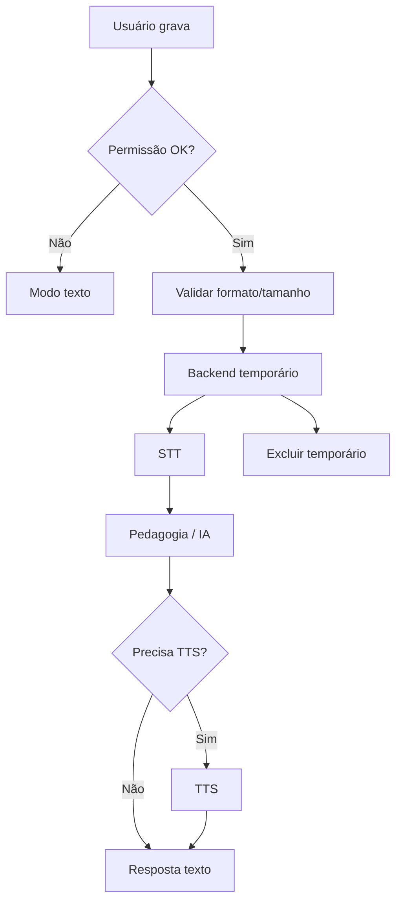

# Arquitetura de Áudio / Fala — Fluentia

Relacionados: [architecture.md](architecture.md), [ai-architecture.md](ai-architecture.md), [privacy.md](privacy.md), [api-specification.md](api-specification.md).

## Princípio

Separar claramente:

1. **Transcrição (STT)** — áudio → texto.
2. **Síntese (TTS)** — texto → áudio.
3. **Avaliação de pronúncia** — feedback sobre fala (pode usar STT, mas **não é o mesmo** que avaliação fonética precisa).

**Transcrição comum não equivale a avaliação fonética precisa.**

## Decisões pendentes

- Provedor STT.
- Provedor TTS.
- Serviço de avaliação de pronúncia.
- Armazenamento externo de arquivos (preferência: evitar).
- Limites exatos de duração e bitrate (faixas abaixo são diretrizes).

## Gravação no navegador

- Usar APIs web de mídia com consentimento do usuário.
- Indicar estado “gravando” de forma clara e acessível.
- Permitir cancelar antes do envio.
- Em mobile, testar Safari/Chrome; falhas → fallback textual.

## Permissões de microfone

- Solicitar apenas quando necessário.
- Se negada: explicar e oferecer modo texto.
- Não entrar em loop agressivo de pedidos.

## Formatos de áudio

- Preferir formatos amplamente suportados no envio (ex.: webm/opus ou wav — escolha final pendente de testes).
- Backend normaliza antes de enviar ao provedor, se preciso.
- Validar MIME e tamanho.

## Limite de duração

- Diretriz inicial: clips curtos para pronúncia e turnos de conversa (valores finais = decisão pendente).
- Rejeitar uploads acima do limite com erro 413 e mensagem clara.

## Envio para backend

- Multipart autenticado.
- Processar em memória/arquivo temporário.
- Nunca expor URL pública permanente sem necessidade.

## Speech-to-Text

- Adaptador modular `SttProvider`.
- Timeout e retry controlado.
- Retornar texto + metadados (confiança se houver, sem exagerar precisão).
- Em falha: erro amigável + fallback textual.

## Text-to-Speech

- Adaptador modular `TtsProvider`.
- Parâmetros: idioma/variante, velocidade, texto.
- Respeitar espanhol da Espanha quando a voz/variante estiver disponível; se não houver voz específica, registrar limitação.
- Cache local temporário opcional; não persistir por padrão.

## Reprodução, interrupção, repetição e velocidade

- Controles na UI: play, pause, stop, replay, velocidade.
- Interromper TTS ao iniciar nova gravação ou nova mensagem.
- Velocidade configurável em settings.

## Exclusão de arquivos temporários

- Apagar após transcrição/síntese ou ao fim da requisição.
- Job de limpeza para órfãos (conceitual; sem Redis obrigatório).
- Não armazenar áudio permanentemente sem necessidade explícita.

## Tratamento de falhas

| Falha | Comportamento |
|---|---|
| Microfone negado | Fallback texto |
| Formato inválido | 400 + orientação |
| Arquivo grande | 413 |
| STT indisponível | 503 + retry + texto |
| TTS indisponível | Mostrar texto da resposta |
| Rede | Mensagem de conexão + retry |

## Compatibilidade móvel

- HTTPS obrigatório para getUserMedia em produção.
- Testar permissões e background/interruptions.
- Evitar depender de gestos obscuros para gravar.

## HTTPS obrigatório

- Em produção, áudio só com HTTPS.
- Documentar isso no deploy ([deployment-coolify.md](deployment-coolify.md)).

## Fallback textual

Sempre disponível em:

- conversação;
- falha de STT/TTS;
- ambientes sem microfone.

## Avaliação de pronúncia

Fases:

1. **Inicial:** feedback baseado em alvo + transcrição + dicas pedagógicas (limitado).
2. **Futura:** provedor especializado de scoring fonético (decisão pendente).

UI deve deixar claro o tipo de feedback (aproximado vs. fonético).

## Fluxo

