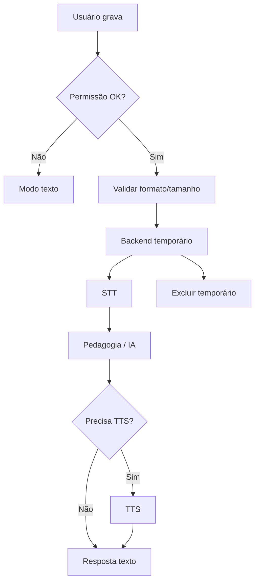

# Arquitetura de Áudio / Fala — BeFluent

Relacionados: [architecture.md](architecture.md), [ai-architecture.md](ai-architecture.md), [privacy.md](privacy.md), [api-specification.md](api-specification.md).

## Princípio

Separar claramente:

1. **Transcrição (STT)** — áudio → texto.
2. **Síntese (TTS)** — texto → áudio.
3. **Avaliação de pronúncia** — feedback sobre fala (pode usar STT, mas **não é o mesmo** que avaliação fonética precisa).

**Transcrição comum não equivale a avaliação fonética precisa.**

## Estado implementado (2026-08)

| Peça | Estado |
|---|---|
| STT primário | Groq `whisper-large-v3-turbo` (`STT_PROVIDER=groq` + `GROQ_API_KEY`) |
| STT fallback | OpenRouter multimodal (`STT_FALLBACK_PROVIDER=openrouter` + `STT_FALLBACK_MODEL`) |
| STT mock | Só com `STT_PROVIDER=mock` explícito; em production, falha → `503 stt_unavailable` (sem transcript fabricado) |
| TTS servidor | Kokoro-82M (`hexgrad/kokoro-82m`) via `/audio/speech` da OpenRouter (`TTS_PROVIDER=openrouter`, mesma `OPENROUTER_API_KEY`); mock só fora de production com `TTS_PROVIDER=mock` |
| TTS produto | Kokoro-82M (backend) como voz principal; **SpeechSynthesis do navegador** só como fallback se a chamada ao backend falhar |
| Pronúncia | Sem score fonético; API devolve `status=unavailable` / `score=null` |
| Duração WebM | Só limite por bytes no backend; duração WAV via `wave`; WebM sem ffprobe (sem mudar Docker) |

## Decisões ainda pendentes

- Serviço de avaliação fonética especializada (P-007).
- Armazenamento externo de arquivos (preferência: evitar).
- Limites finos de bitrate (hoje: `MAX_AUDIO_BYTES` / `MAX_AUDIO_DURATION_SECONDS`).

## Gravação no navegador

- Usar APIs web de mídia com consentimento do usuário.
- Indicar estado “gravando” de forma clara e acessível.
- Permitir cancelar antes do envio.
- Em mobile, testar Safari/Chrome; falhas → fallback textual.

## Permissões de microfone

- Solicitar apenas quando necessário.
- Se negada: explicar e oferecer modo texto.
- Não entrar em loop agressivo de pedidos.

## Formatos de áudio

- Frontend: `MediaRecorder` preferindo `audio/webm;codecs=opus` (fallback `audio/webm` / `audio/ogg`).
- Backend: aceita o `content_type` do upload e escolhe extensão para Groq/OpenRouter.
- Validar tamanho (`MAX_AUDIO_BYTES`). Duração só é medida com precisão em WAV; WebM/Ogg não passam por ffprobe nesta fase.

## Limite de duração

- Diretriz inicial: clips curtos para pronúncia e turnos de conversa (valores finais = decisão pendente).
- Rejeitar uploads acima do limite com erro 413 e mensagem clara.

## Envio para backend

- Multipart autenticado.
- Processar em memória/arquivo temporário.
- Nunca expor URL pública permanente sem necessidade.

## Speech-to-Text

- Factory em `app/services/speech.py`: cadeia Groq → OpenRouter.
- Retorno: `{ text, language_code, provider, model }`.
- Em falha (production): `503 stt_unavailable` + UI com retry / texto.
- Em desenvolvimento sem chaves: mock explícito ou fallback mock após falha da cadeia.

## Text-to-Speech

Documentação completa (arquitetura, voice mapping, fallback, rollback,
troubleshooting): [TTS.md](TTS.md). Resumo:

- Produto: `AudioPlayer` chama `POST /api/v1/speech/synthesize`, que sintetiza com Kokoro-82M (`hexgrad/kokoro-82m`) via OpenRouter e devolve mp3.
- Voz escolhida por idioma (`_KOKORO_VOICE_BY_LANGUAGE` em `app/services/speech.py`), fixada manualmente após escuta comparativa no Kokoro Voice Lab (`/admin/tts-lab`) — não é ranking automático: en→`af_sky`, es→`em_alex`, fr→`ff_siwis`, ja→`jf_nezumi`, zh→`zf_xiaoxiao`. Idioma fora desse allowlist devolve `400 tts_unsupported_language` (nunca "adivinha" uma voz). `TTS_VOICE` força uma voz única para qualquer idioma, se definido.
- Velocidade da UI do `AudioPlayer` é enviada no corpo da requisição (`speed`) e renderizada nativamente pelo Kokoro (não é `playbackRate` do navegador).
- Se a chamada ao backend falhar (rede, timeout, `tts_unavailable`, `tts_unsupported_language`, ou o `<audio>` disparar `onError`), o `AudioPlayer` cai automaticamente no `window.speechSynthesis` do navegador — fallback, não mais o caminho principal. O aluno nunca vê o erro técnico; a falha só fica registrada nos logs do backend.
- Fora de production, sem `TTS_PROVIDER=openrouter` configurado, o endpoint segue as mesmas regras de mock do resto do projeto (`TTS_PROVIDER=mock`). `TTS_PROVIDER=web_speech` desativa o Kokoro de servidor por configuração (rollback), sem remover código.

## Reprodução, interrupção, repetição e velocidade

- Controles na UI: play, pause, stop, replay, velocidade.
- Interromper TTS ao iniciar nova gravação ou nova mensagem.
- Velocidade configurável em settings.

## Exclusão de arquivos temporários

- Apagar após transcrição/síntese ou ao fim da requisição.
- Job de limpeza para órfãos (conceitual; sem Redis obrigatório).
- Não armazenar áudio permanentemente sem necessidade explícita.

## Tratamento de falhas

| Falha | Comportamento |
|---|---|
| Microfone negado | Fallback texto |
| Formato inválido | 400 + orientação |
| Arquivo grande | 413 |
| STT indisponível | 503 + retry + texto |
| TTS indisponível | Mostrar texto da resposta |
| Rede | Mensagem de conexão + retry |

## Compatibilidade móvel

- HTTPS obrigatório para getUserMedia em produção.
- Testar permissões e background/interruptions.
- Evitar depender de gestos obscuros para gravar.

## HTTPS obrigatório

- Em produção, áudio só com HTTPS.
- Documentar isso no deploy ([deployment-coolify.md](deployment-coolify.md)).

## Fallback textual

Sempre disponível em:

- conversação;
- falha de STT/TTS;
- ambientes sem microfone.

## Avaliação de pronúncia

Fases:

1. **Atual:** prática com frase-alvo + TTS local + STT; UI compara alvo e transcrição **sem nota**.
2. **Futura:** provedor especializado de scoring fonético (P-007).

Nunca fabricar `score` (ex.: 85) nem transformar similaridade de STT em “nota de pronúncia”.

## Fluxo

