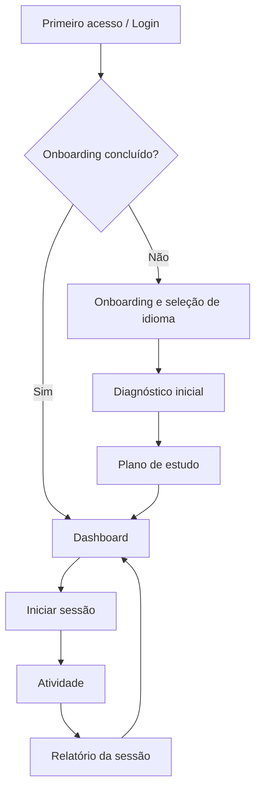
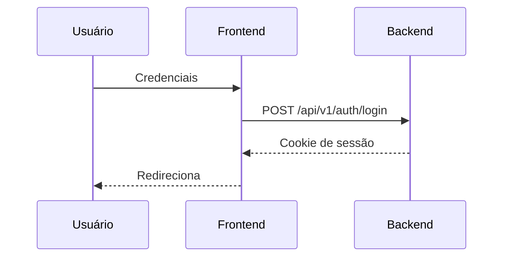
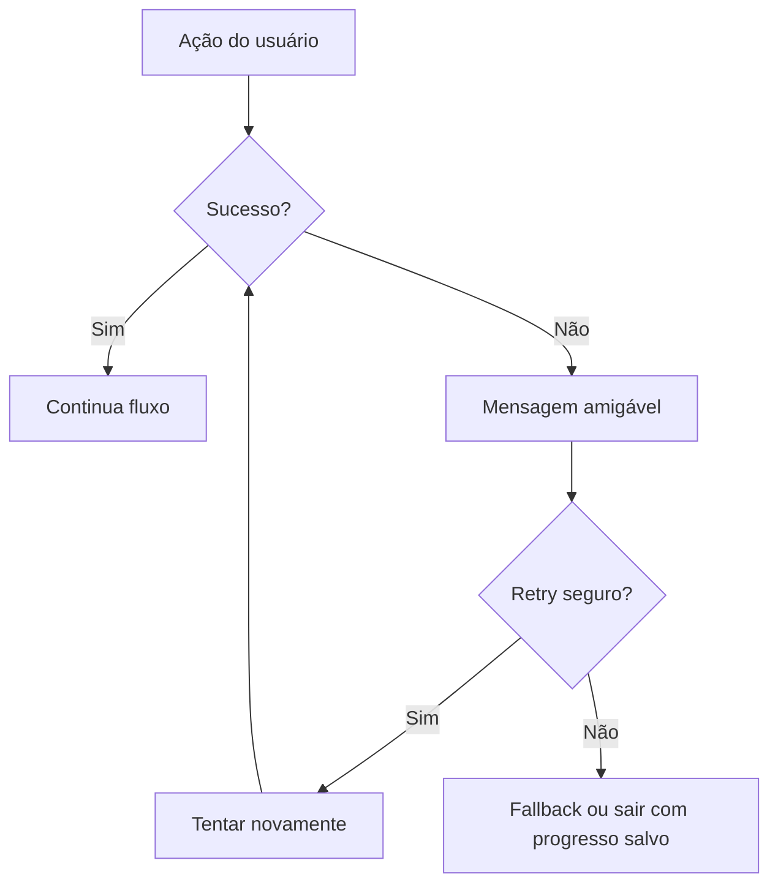

# Fluxos de Usuário — BeFluent

Documentos relacionados: [screens.md](screens.md), [product-requirements.md](product-requirements.md), [error-handling.md](error-handling.md).

## Convenções

- Interface em português.
- Um único usuário autorizado.
- Idiomas: inglês, espanhol da Espanha, francês, japonês, mandarim.
- Em falhas, preferir mensagem clara + retry quando seguro.

## Visão geral

## 1. Primeiro acesso

1. Usuário abre a URL do BeFluent.
2. Se não autenticado, vai para login.
3. Após login, se não houver onboarding concluído, inicia onboarding.
4. Caso contrário, vai ao dashboard.

## 2. Login

1. Informar credenciais.
2. Backend valida e cria sessão com cookie HTTP-only.
3. Sucesso → dashboard ou onboarding.
4. Falha → mensagem amigável sem revelar detalhes internos.

## 3. Escolha do idioma

1. Listar os cinco idiomas.
2. Usuário seleciona um idioma (ex.: espanhol da Espanha).
3. Sistema cria/ativa `UserLanguage` se necessário.
4. Se não houver diagnóstico, oferecer diagnóstico.
5. Se houver plano, mostrar plano; senão, criar plano após diagnóstico.

## 4. Diagnóstico inicial

1. Explicar objetivo do diagnóstico (estimar nível e dificuldades).
2. Apresentar questões/atividades curtas por habilidade relevante ao idioma.
3. Registrar respostas e tempo.
4. Gerar perfil inicial (nível estimado, dificuldades, recomendações).
5. Não apresentar equivalência automática rígida a CEFR/JLPT/HSK.
6. Avançar para criação do plano.

## 5. Criação do plano de estudo

1. Com base no diagnóstico e na estratégia do idioma ([language-strategies.md](language-strategies.md)).
2. Gerar itens de plano (aulas, vocabulário, revisão, conversação, etc.).
3. Mostrar plano resumido e permitir iniciar a primeira atividade.
4. Plano pode ser atualizado após sessões futuras.

## 6. Início de uma sessão

1. No dashboard, usuário escolhe “Continuar” ou uma atividade específica.
2. Sistema cria `StudySession` vinculada ao idioma ativo.
3. Carrega contexto pedagógico resumido (nível, erros recentes, objetivo da sessão).
4. Encaminha à atividade recomendada.

## 7. Aula guiada

1. Exibir objetivo da aula.
2. Apresentar explicação + exemplos.
3. Propor atividades curtas.
4. Registrar tentativas.
5. Ao concluir, marcar item do plano e oferecer próxima atividade ou encerrar sessão.

## 8. Conversação

### Texto

1. Abrir conversa com tema e nível adequados.
2. Usuário envia mensagem.
3. Backend chama IA (com validação de saída).
4. Exibir resposta + correções/explicações quando houver erro.
5. Registrar mensagens e erros.

### Voz

1. Solicitar permissão de microfone (se necessário).
2. Gravar → enviar → STT → processar como mensagem.
3. Resposta pode incluir TTS.
4. Em falha de áudio, oferecer fallback textual.

## 9. Exercício de pronúncia

1. Mostrar/ouvir o alvo.
2. Usuário grava.
3. Transcrição e/ou avaliação (avaliação fonética precisa = decisão pendente de provedor).
4. Feedback claro: o que melhorar, exemplo correto.
5. Permitir repetir.

**Nota:** transcrição comum não equivale a avaliação fonética precisa.

## 10. Compreensão auditiva

1. Reproduzir áudio (TTS ou áudio preparado).
2. Controles: play, pause, repetir, velocidade.
3. Questões de compreensão.
4. Feedback e registro de erros.

## 11. Revisão de vocabulário

1. Buscar itens devidos (repetição espaçada / erros).
2. Apresentar cartão (frente → resposta → avaliação de dificuldade).
3. Atualizar agendamento.
4. Encerrar quando lote do dia for concluído ou usuário sair.

## 12. Encerramento da sessão

1. Usuário encerra ou conclui a última atividade planejada.
2. Sistema marca sessão como concluída.
3. Dispara geração de relatório.
4. Atualiza métricas e recomendações.

## 13. Geração do relatório

1. Compilar atividades feitas, acertos, erros e próximos passos.
2. Exibir relatório em linguagem clara.
3. Oferecer links para revisão de erros ou voltar ao dashboard.

## 14. Consulta ao progresso

1. Selecionar idioma.
2. Ver histórico de sessões, vocabulário, erros e tendência por habilidade.
3. Evitar sobrecarga visual de métricas.

## 15. Alteração de configurações

1. Abrir configurações.
2. Ajustar preferências (idioma padrão, velocidade de áudio, etc.).
3. Salvar e confirmar.
4. Preferências sensíveis de segurança não ficam no frontend além do necessário.

## 16. Recuperação diante de erros

### IA indisponível / timeout / resposta inválida

1. Mostrar mensagem: “O tutor está temporariamente indisponível.”
2. Oferecer tentar novamente.
3. Se persistir, permitir continuar com atividades que não dependam de IA (quando existirem) ou encerrar sessão com salvamento do progresso parcial.

### Falha de áudio (STT/TTS/microfone)

1. Explicar a falha (permissão, rede, serviço).
2. Oferecer fallback textual.
3. Não bloquear o restante do estudo.

### Perda de conexão

1. Detectar falha de rede.
2. Avisar e permitir retry.
3. Evitar perda silenciosa de respostas já confirmadas pelo servidor.

